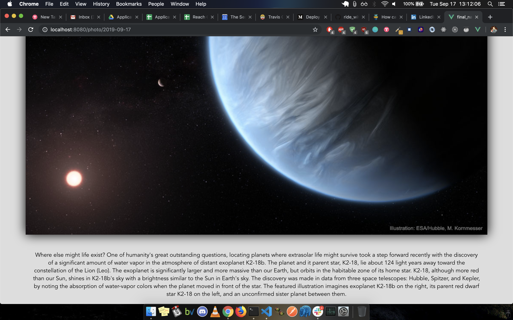

# NASA APOD Vue Code Challenge

## Description

This project is a theoretical takehome code challenge. The prompt goes as follows: "Build a single-page application in **Vue.js** that queries the NASA Astronomy Picture of the Day API and displays the day's image. The application should include a way to view each of the current month's pictures (it's okay if the month only has 1 photo so far, for example if it's the first of the month), and a way to return to the current day's picture. Be creative with how you present the collections - think about the experience of the viewer with what they want to view and learn."

## SetUp
- Clone down this repo and cd into the directory.
- Run `npm install` to install all dependencies onto you local machine.
- Run `npm start` to get app running.
- Open the code in your prefered code editing saftware.

## Project Successes

I come from a React.js background, and Vue is... a bit different. I only had a few days to complete this project; so in that time frame I needed to learn Vue.js, understand it's router functionality, conditional rendering mechanics, templating style, deployment strategy; and, of course, to actually build the app. But I'm proud of the outcome, and I think I will enjoy using Vue.js in upcoming projects.

## Project Challenges

As always, writing modular code required careful planning and strategic architecture, and especially under the time constraints it was important to do as much planning ahead as possible; however, with such a tight time frame it was difficult to forsee and plan for all of the pitfalls. My project management tools and git workflow smoothed the bumps that unforseen issues created, but with a new framework, challenges with some of the more esoteric mechanics - especially conditional rendering and routing - tended to slow my progress.

Also, testing. As ashamed as I am to admit it, here goes: I have zero tests. The basic functionality of the app and it's deployment simply took priority. *shame*

## Project Extensions/Issues

* Build out a robust testing suite.
* Create search by date and title functionality.
* Add page transitions.
* Create a layout that takes advantage of a CSS masonry grid style.

## Project Tech Emphasis

* JavaScript
* Vue.js
* Vue Router
* Trello
* GH Pages for deployment

## Project Management

I used Trello issues to manage workflow.

## Project Comps:

### Loading Screen

### Splash/Monthly Photos

### Photo by Day

## Developers

[Jev Forsberg](https://github.com/baldm0mma)